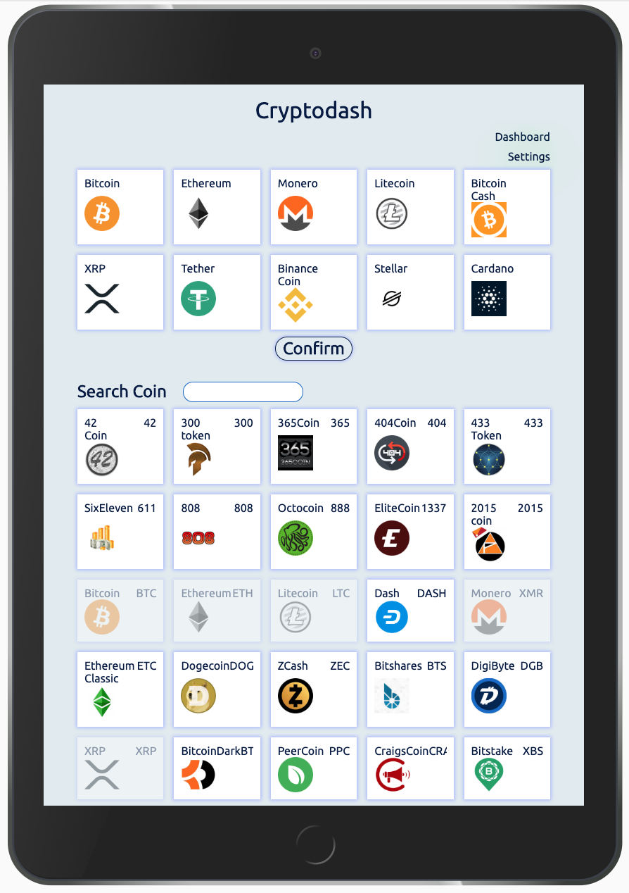
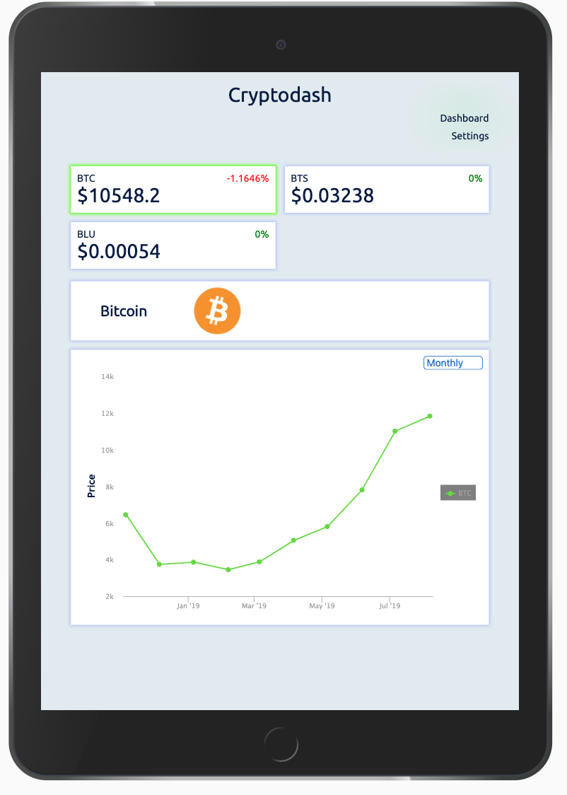

# How to set up the Crypto Dashboard App on your computer:

1. Download the repository's ZIP file and unzip it.
2. With your terminal navigate inside the unzipped project folder.
3. Type on your terminal 'yarn install' and press ENTER.
4. Type on your terminal 'yarn start' and press ENTER.
5. Chrome will open and go to the local host 'http://localhost:3000/'.

# How to use Crypto Dashboard:

1. Press on the "Square" button to load the page in Square view:
   

  

2. Press on the "Cascade" button to load the page in Cascade view:
   
